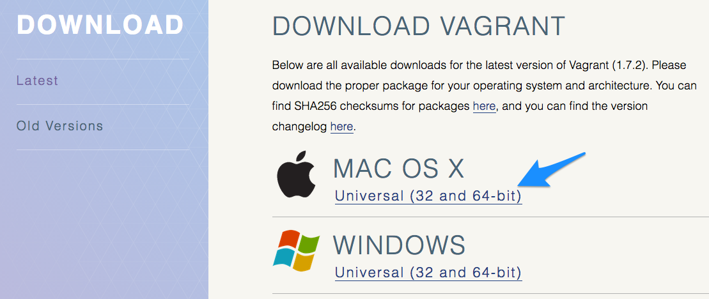
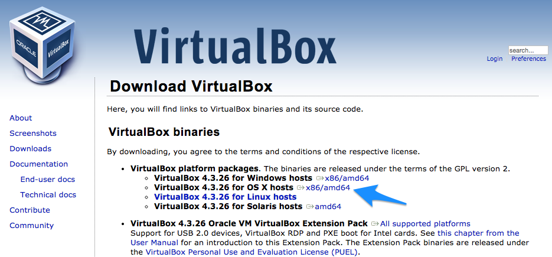
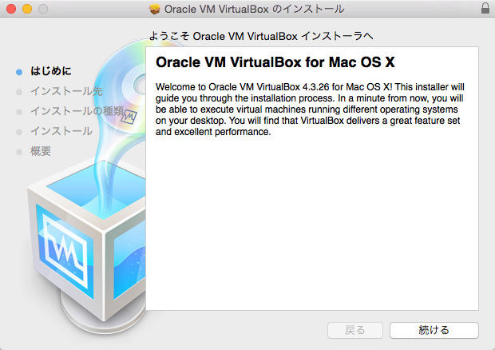
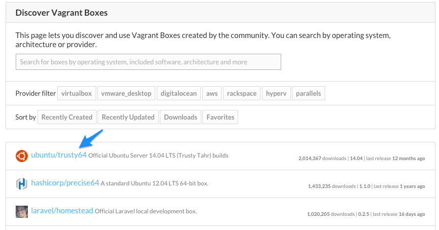

# Vagrantとは

Vagrant(ベイグラント)は, Rubyで開発されたオープンソースの仮想環境開発構築ソフトウェアです.
Vagrantを利用することで, 仮想マシン(Virutal Machine, VM)と呼ばれる｢仮想的な作業環境｣を, ローカル環境上に構築することができます.

# Vagrantのインストール

もし, Homebrew Caskを導入済みであれば, 次のコマンドでインストールすることが出来ます.

```
$ brew cask install vagrant
```

Homebrew Caskを利用していないのであれば, 次の手順に従ってVagrantをインストールしましょう.

- Vagrantの[ダウンロードページ](https://www.vagrantup.com/downloads.html)から, ｢MAC OS X｣と書かれた下の｢Universal (32 and 64bit)｣をクリックし, [Mac OS X用のディスクイメージ](https://dl.bintray.com/mitchellh/vagrant/vagrant_1.7.2.dmg)をダウンロードします.



- ダウンロードしたディスクイメージをダブルクリックすると, 次のような画面が表示されます.


- ｢Vagrant.pkg｣をダブルクリックすると, インストーラが起動します.


- 後は, 指示に従いながら｢続ける｣ボタンを押し続けると, インストールが完了します.


# VirtualBoxのインストール

続いて, Vagrantが仮想環境を構築するために利用する, VirtualBoxをインストールします.
VirtualBoxは, もしHomebrew Caskを導入済みであれば, 次のコマンドでインストールすることが出来ます.

```
$ brew cask install virtualbox
```

Homebrew Caskを利用していないのであれば, 次の手順に従ってVagrantをインストールしましょう.

- VirtualBoxの[ダウンロードページ](https://www.virtualbox.org/wiki/Downloads)から, ｢VirtualBox binaries｣の｢VirtualBox 4.3.26 for OS X hosts｣と書かれた右の｢x86/amd64｣と書かれたリンクをクリックし, [ディスクイメージ](http://download.virtualbox.org/virtualbox/4.3.26/VirtualBox-4.3.26-98988-OSX.dmg)をダウンロードします.



- ダウンロードしたディスクイメージをダブルクリックすると, 次のような画面が表示されます.



- 後は, Vagrantのインストール時と同じく, 指示に従いながら｢続ける｣ボタンを押し続けると, インストールが完了します.

# `vagrant`コマンド

Vagrantのインストールが無事終わっていれば, コマンドラインから`vagrant`コマンドが利用できるようになっているはずです.

```
$ which vagrant
/usr/bin/vagrant
$ vagrant --version
Vagrant 1.7.2
```

...それでは, Vagrantを利用して開発環境となる仮想マシンを立ち上げていきましょう.

# Boxの取得

Vagrantでは, ｢Box｣と呼ばれる仮想マシンのベースイメージ(雛形)から仮想マシンを構築します.
通常, VirtualBoxやVMwareで仮想マシンを立ち上げた場合, そこから更にOSのインストールなどを実施していく必要があります.
Vagrantでは, OSや必要なアプリケーションが既に導入されているBoxから仮想マシンを構築することで, これらの導入と設定にかかる時間を節約することができます.

Vagrantが利用するBoxは, 後述するPackerなどで準備することも出来ますが, [Discover Vagrant Boxes](https://atlas.hashicorp.com/boxes/search)から検索し, 入手することもできます.
今回は, ここからUbuntu Server 14.04 LTSの64bit版のBoxを入手し, このボックスからローカル環境に仮想マシンを立ち上げることにします.



丁度, Discovery Vagrant Boxesのトップに該当のBoxがあったので, これをVagrantに登録します.
他のOSのBox, 例えばCentOSやDebianが導入済みのBoxが欲しければ, ページ上部の検索ボックスから検索するようにしましょう.

`vagrant`コマンドからは, Discovery Vagrant Boxesに登録されているBoxの名前を使って, 入手(ダウンロード)することが出来ます.
Boxの名称ですが, 上記の画像の青矢印の先, リンクになっている部分のテキストが, Boxの名称になっています.
手元のBoxを追加するための`vagrant box add`コマンドを使ってこのBoxを登録してみます.

```
$ vagrant box add ubuntu/trusty64
==> box: Loading metadata for box 'ubuntu/trusty64'
    box: URL: https://atlas.hashicorp.com/ubuntu/trusty64
==> box: Adding box 'ubuntu/trusty64' (v14.04) for provider: virtualbox
    box: Downloading: https://vagrantcloud.com/ubuntu/boxes/trusty64/versions/14.04/providers/virtualbox.box
==> box: Successfully added box 'ubuntu/trusty64' (v14.04) for 'virtualbox'!
```

成功しました.
既に取得済みのBoxを確認出来る, `vagrant box list`コマンドで確認してみます.

```
$ vagrant box list
ubuntu/trusty64 (virtualbox, 14.04)
```

## 練習問題

Discovery Vagrant Boxesから, CentOS 6.6のBoxを検索し, 取得してみよう.

# Vagrantfileの準備

それでは, 先程取得したBoxから, 仮想マシンを構築していきます.
そのために, `vagrant init`コマンドで｢Vagrantfile｣と呼ばれるVagrant用の設定ファイルを生成します.
Vagrantは, このVagrantfileに記述された設定を元に, 仮想マシンを構築します.

```
$ vagrant init ubuntu/trusty64
A `Vagrantfile` has been placed in this directory. You are now
ready to `vagrant up` your first virtual environment! Please read
the comments in the Vagrantfile as well as documentation on
`vagrantup.com` for more information on using Vagrant.
```

この際, 上記のように`vagrant init`の後にBox名を指定すると, そのBoxを利用するようなVagrantfileが生成されます.

さて, Vagrantfileの中身を確認してみます.
コメント部分を除くと, 次のようになっています.

```rb
# -*- mode: ruby -*-
# vi: set ft=ruby :

Vagrant.configure(2) do |config|
  config.vm.box = "ubuntu/trusty64"
end
```

VagrantfileはRubyで書かれており, ここでは起動するBox(`config.vm.box`)に先程取得し, `vagrant init`時に指定した｢ubuntu/trusty64｣を代入しています.
ここでは省略しますが, Vagrantfileに設定を書く事で, 様々なパターンの仮想マシンを構築することが出来ます(例えば, 仮想マシンに割り振るIPを指定したり, 一度に複数の仮想マシンを用意したりすることもできます).

これで, Vagrantで仮想マシンを立ち上げる準備が出来ました!

# 仮想マシンの起動

Vagrantによる仮想マシンの起動は, Vagrantfileがあるディレクトリで`vagrant up`すればOKです.

```
$ ls
Vagrantfile

$ vagrant up
Bringing machine 'default' up with 'virtualbox' provider...
==> default: Checking if box 'ubuntu/trusty64' is up to date...
==> default: Clearing any previously set forwarded ports...
==> default: Clearing any previously set network interfaces...
==> default: Preparing network interfaces based on configuration...
    default: Adapter 1: nat
==> default: Forwarding ports...
    default: 22 => 2222 (adapter 1)
==> default: Booting VM...
==> default: Waiting for machine to boot. This may take a few minutes...
    default: SSH address: 127.0.0.1:2222
    default: SSH username: vagrant
    default: SSH auth method: private key
    default: Warning: Connection timeout. Retrying...
    default: Warning: Remote connection disconnect. Retrying...
==> default: Machine booted and ready!
Got different reports about installed GuestAdditions version:
Virtualbox on your host claims:   4.3.10
VBoxService inside the vm claims: 4.3.26
Going on, assuming VBoxService is correct...
GuestAdditions seems to be installed (4.3.26) correctly, but not running.
Got different reports about installed GuestAdditions version:
Virtualbox on your host claims:   4.3.10
VBoxService inside the vm claims: 4.3.26
Going on, assuming VBoxService is correct...
stdin: is not a tty
Starting the VirtualBox Guest Additions ...done.
Got different reports about installed GuestAdditions version:
Virtualbox on your host claims:   4.3.10
VBoxService inside the vm claims: 4.3.26
Going on, assuming VBoxService is correct...
Got different reports about installed GuestAdditions version:
Virtualbox on your host claims:   4.3.10
VBoxService inside the vm claims: 4.3.26
Going on, assuming VBoxService is correct...
==> default: Checking for guest additions in VM...
==> default: Mounting shared folders...
    default: /vagrant => /path/to/vagrantfile
==> default: Machine already provisioned. Run `vagrant provision` or use the `--provision`
==> default: to force provisioning. Provisioners marked to run always will still run.
```

現在の仮想マシンの様子は, `vagrant status`で確認できます.

```
$ vagrant status
Current machine states:

default                   running (virtualbox)

The VM is running. To stop this VM, you can run `vagrant halt` to
shut it down forcefully, or you can run `vagrant suspend` to simply
suspend the virtual machine. In either case, to restart it again,
simply run `vagrant up`.
```

`running`になっており, 問題なく動いている事がわかります.
それでは引き続き, Vagrantが用意した仮想マシンに接続してみましょう.

## コラム: Vagrantfileの共有

チームで開発を進めている場合, 開発環境を構築するためのVagrantfileはリポジトリに含めておくようにしましょう.
他の開発メンバーも, そのVagrantfileを利用して, 開発環境を構築出来るようになります.

もし, リポジトリで共有したVagrantfileから`vagrant up`した際, Vagrantfile内で指定しているBoxが追加されていない場合, Vagrantは自動的にDiscovery Vagrant Boxesから該当するBoxを検索し, あればそのBoxを追加してから仮想マシンの構築をスタートします.

# 仮想マシンへの接続

Vagrantで立ち上げた仮想マシンへの接続方法はいくつかあります.
ひとつは, Vagrantfileがあるディレクトリで`vagrant ssh`と入力する方法です.

```
$ vagrant ssh
Welcome to Ubuntu 14.04.2 LTS (GNU/Linux 3.13.0-48-generic x86_64)

 * Documentation:  https://help.ubuntu.com/

  System information as of Fri Mar 27 04:19:22 UTC 2015

  System load:  0.25              Processes:           75
  Usage of /:   2.8% of 39.34GB   Users logged in:     0
  Memory usage: 24%               IP address for eth0: 10.0.2.15
  Swap usage:   0%

  Graph this data and manage this system at:
    https://landscape.canonical.com/

  Get cloud support with Ubuntu Advantage Cloud Guest:
    http://www.ubuntu.com/business/services/cloud


Last login: Fri Mar 27 04:19:22 2015 from 10.0.2.2
vagrant@vagrant-ubuntu-trusty-64:~$
```

この方法は, Vagrantfileがあるディレクトリでしか使えませんが, 特にそれ以外の設定をすることなく, Vagrantで立ち上げた仮想マシンに接続することができます.

もう1つは, `vagrant ssh-config`コマンドで生成できるSSHの設定を`~/.ssh/config`に追加し, SSHで接続する方法.
この方法を利用すると, 仮想マシンが起動していればVagrantfileがないディレクトリからでも, 仮想マシンに接続することができます.

```
$ vagrant ssh-config
Host default
  HostName 127.0.0.1
  User vagrant
  Port 2222
  UserKnownHostsFile /dev/null
  StrictHostKeyChecking no
  PasswordAuthentication no
  IdentityFile /path/to/vagrantfile/.vagrant/machines/default/virtualbox/private_key
  IdentitiesOnly yes
  LogLevel FATAL
```

ホスト名は, `vagrant ssh-config`に`--host`オプションを与えることで指定できます.
今回は, ｢vagrant-tutorial｣という名前で登録することにしましょう.

```
$ vagrant ssh-config --host vagrant-tutorial
Host vagrant-tutorial
  HostName 127.0.0.1
  User vagrant
  Port 2222
  UserKnownHostsFile /dev/null
  StrictHostKeyChecking no
  PasswordAuthentication no
  IdentityFile /path/to/vagrantfile/.vagrant/machines/default/virtualbox/private_key
  IdentitiesOnly yes
  LogLevel FATAL
```

この設定を, `~/.ssh/config`に追記します.

```
$ vagrant ssh-config --host vagrant-tutorial >> ~/.ssh/config
```

後は, `ssh`コマンドで`vagrant-tutorial`を指定すれば, 仮想マシンに接続できます.

```
$ ssh vagrant-tutorial
```

## コラム: 複数の仮想マシンの立ち上げ

Vagrantfileを上手く設定すれば, プロダクトに必要な開発環境を, 柔軟に構築することが出来ます.
例えば, 例としてアプリケーション用とデータベース用の2つの仮想マシンを立ち上げる為のVagrantfileを紹介します.

```rb
Vagrant.configure(2) do |config|
  config.vm.define :"app" do |app|
    app.vm.box      = "ubuntu/trusty64"
    app.vm.hostname = "app"
    app.vm.network :private_network, ip: "192.168.33.10"
    app.vm.provider "virtualbox" do |vb|
      vb.name = "app"
    end
  end

  config.vm.define :"db" do |db|
    db.vm.box      = "ubuntu/trusty64"
    db.vm.hostname = "db"
    db.vm.network :private_network, ip: "192.168.33.11"
    db.vm.provider "virtualbox" do |vb|
      vb.name = "db"
    end
  end
end
```

このように記載すると, ｢192.168.33.10｣というIPで｢app｣という名前の仮想マシンを, ｢192.168.33.11｣というIPで｢db｣という名前の仮想マシンを構築することができます.

`vagrant up`した後, `vagrant status`で状況を確認すると,

```
$ vagrant status
Current machine states:

app                       running (virtualbox)
db                        running (virtualbox)

This environment represents multiple VMs. The VMs are all listed
above with their current state. For more information about a specific
VM, run `vagrant status NAME`.
```

このように, ｢app｣と｢db｣の2台が同時に動いていることが確認出来ます.
同様に, `vagrant ssh-config`についても｢app｣と｢db｣の2台分の設定が出力されるので, これを`~/.ssh/config`に記述すれば`ssh`コマンドから仮想マシンにログインすることが出来るようになります.

また, Vagrant用のSSH公開鍵は`/path/to/vagrantfile/.vagrant/machines/[hostname]/virtualbox/private_key`に設置されていますので, 例えば｢app｣に接続したいのであれば,

```
$ ssh vagrant@192.168.33.10 -i /path/to/vagrantfile/.vagrant/machines/app/virtualbox/private_key
Welcome to Ubuntu 14.04.2 LTS (GNU/Linux 3.13.0-48-generic x86_64)

 * Documentation:  https://help.ubuntu.com/

  System information as of Mon Mar 30 05:25:07 UTC 2015

  System load:  0.09              Processes:           73
  Usage of /:   2.8% of 39.34GB   Users logged in:     0
  Memory usage: 26%               IP address for eth0: 10.0.2.15
  Swap usage:   0%                IP address for eth1: 192.168.33.11

  Graph this data and manage this system at:
    https://landscape.canonical.com/

  Get cloud support with Ubuntu Advantage Cloud Guest:
    http://www.ubuntu.com/business/services/cloud


Last login: Mon Mar 30 05:25:08 2015 from 192.168.33.1
vagrant@app:~$
```

このように直接利用する鍵を指定することで, `ssh`コマンドで接続することもできます.

その他, Vagrantfileで設定できる項目については, [公式ドキュメント](http://docs.vagrantup.com/v2/vagrantfile/index.html)([日本語版](http://lab.raqda.com/vagrant/vagrantfile/index.html))に記載があります.

# 仮想マシンの停止

では次に, 立ち上げた仮想マシンを停止してみましょう.
仮想マシンは, 動いている限りマシンのリソースを使い続けます.
そのため, 使わない仮想マシンは極力停止しておく事が望まれます.

なお, 仮想マシンに保存したデータは, 仮想マシンそのものを削除しない限り残り続けます.
今回は, 適当なファイルを保存してから仮想マシンを停止することで, 本当にデータが消えないかを確認してみましょう.

```
vagrant@vagrant-ubuntu-trusty-64:~$ touch data.txt
vagrant@vagrant-ubuntu-trusty-64:~$ ls
data.txt
```

仮想マシンの中で, `touch`コマンドで適当なファイルを生成します.
仮想マシンからローカルに戻る場合は, 仮想マシンの中で`exit`などを実行すればよいです.

```
vagrant@vagrant-ubuntu-trusty-64:~$ exit
logout
Connection to 127.0.0.1 closed.
```

`exit`は仮想マシンから切断するだけなので, `vagrant status`で確認すると, まだ仮想マシンは動き続けています.

```
$ vagrant status
Current machine states:

default                   running (virtualbox)

The VM is running. To stop this VM, you can run `vagrant halt` to
shut it down forcefully, or you can run `vagrant suspend` to simply
suspend the virtual machine. In either case, to restart it again,
simply run `vagrant up`.
```

それでは, `vagrant halt`で仮想マシンを停止してみましょう.

```
$ vagrant halt
==> default: Attempting graceful shutdown of VM...
```

`vagrant status`で状況を確認してみます.

```
$ vagrant status
Current machine states:

default                   poweroff (virtualbox)

The VM is powered off. To restart the VM, simply run `vagrant up`
```

｢poweroff｣になっていますね.
実際, `vagrant ssh`で再度接続しようとしても, 仮想マシンが停止しているので接続出来ません.

```
$ vagrant ssh
VM must be running to open SSH connection. Run `vagrant up`
to start the virtual machine.
```

停止した仮想マシンは, `vagrant up`で再度起動できます.

```
$ vagrant up
Bringing machine 'default' up with 'virtualbox' provider...
==> default: Checking if box 'ubuntu/trusty64' is up to date...
==> default: Clearing any previously set forwarded ports...
==> default: Clearing any previously set network interfaces...
==> default: Preparing network interfaces based on configuration...
    default: Adapter 1: nat

    ... 中略 ...

==> default: Checking for guest additions in VM...
==> default: Mounting shared folders...
    default: /vagrant => /path/to/vagrantfile
==> default: Machine already provisioned. Run `vagrant provision` or use the `--provision`
==> default: to force provisioning. Provisioners marked to run always will still run.
```

再度仮想マシンに接続してから, `ls`コマンドで先程作成した`data.txt`というファイルがあるか確認してみましょう.

```
$ vagrant ssh-config

    ... 中略 ...

vagrant@vagrant-ubuntu-trusty-64:~$ ls
data.txt
```

先程作成した`data.txt`が残っていますね!

# 仮想マシンの削除

それでは最後に, 仮想マシンを削除しましょう.
停止している仮想マシンは, メモリやCPUなどのリソースは消費しませんが, ディスク容量は消費し続けます.
使わなくなった仮想マシンは, 適度なタイミングで整理し, 削除するようにしましょう.

仮想マシンは, `vagrant destroy`コマンドで削除することができます.

```
$ vagrant destroy
    default: Are you sure you want to destroy the 'default' VM? [y/N] y
==> default: Forcing shutdown of VM...
==> default: Destroying VM and associated drives...
```

仮想マシンを停止していない状態で削除したので, ｢Forcing shutdown｣ということで, 強制的に仮想マシンを停止してから仮想マシンを削除しています.

```
$ vagrant status
Current machine states:

default                   not created (virtualbox)

The environment has not yet been created. Run `vagrant up` to
create the environment. If a machine is not created, only the
default provider will be shown. So if a provider is not listed,
then the machine is not created for that environment.
```

`vagrant status`で確認すると, Vagrantfileはあるが仮想マシンがないということで, ｢not created｣になっています.

ここから, 再度`vagrant up`すれば仮想マシンを作成することができます.
ただ, 当然ではありますが, 新しい仮想マシンを立ち上げたのと同じ状態ですので, 削除前の仮想マシンで作った`data.txt`は残っていません.

## コラム: `vagrant`ディレクトリの共有

`vagrant up`時に, このような出力が出ているはずです.

```
==> default: Mounting shared folders...
    default: /vagrant => /path/to/vagrantfile
```

これは, ローカル環境のVagrantfileがあるディレクトリを, 仮想マシンの`/vagrant`にマウントしている, ということを指します.

```
vagrant@app:/vagrant$ cd /vagrant/
vagrant@app:/vagrant$ ls
Vagrantfile
```

このように, Vagrantを動かしているローカル環境のファイルを, `/vagrant`ディレクトリを通して仮想マシン側でも利用することができます.

プロダクトのルートディレクトリにVagrantfileを設置して`vagrant up`をすれば, プロダクトのコードが全て`/vagrant`ディレクトリにマウントされるので, 別途GitHubやBitBucketからプロダクトのコードを取得する必要がなくなり, 非常に便利です.

# 練習問題

適当なAmon2アプリケーションを, NginxとSupervisorを利用してVagrant上で動かせるように, 環境構築をしてみましょう.

## アプリケーションの用意

`amon2-setup.pl`で適当なAmon2アプリケーションを用意します.

```
$ cpanm Amon2 Amon2::Lite
$ amon2-setup.pl SampleApp --flavor=Lite
$ ls
SampleApp
```

Amon2のLite flavorにはcpanfileが用意されていないので, 別途用意します.

```
$ vi SampleApp/cpanfile
+ requires 'Amon2';
+ requires 'Amon2::Lite';
+ requires 'Starlet';
```

## Vagrantfileの用意と仮想マシンの起動

今回は, 予めいくつか設定しておきたい項目があるので, `vagrant init`ではなく手動でVagrantfileを生成します.

```
$ vi Vagrantfile
+ Vagrant.configure(2) do |config|
+   config.vm.box = "ubuntu/trusty64"
+ 
+   config.vm.provider "virtualbox" do |v|
+     v.customize [
+       "modifyvm", :id,
+       "--memory", 1024,
+     ]
+   end
+ 
+   config.vm.network :private_network, ip: "192.168.30.10"
+ end
```

`config.vm.provider`以下の部分で, 仮想マシンにメモリを1024MB割り当てるよう設定しています.
また, `config.vm.network`では, この仮想マシンに`192.168.30.10`というIPを割り振るように設定しています.

```
$ vagrant up
```

問題なく起動出来れば, カレントディレクトリが仮想マシンの`/vagrant`にマウントされているはずなので, 先程生成したSampleAppディレクトリも仮想マシンから参照出来るようになっています.

```
$ vagrant ssh
vagrant@vagrant-ubuntu-trusty-64:~$ ls /vagrant
SampleApp  Vagrantfile
```

## Perlのインストール

[xbuild](https://github.com/tagomoris/xbuild)を使って仮想マシンにPerlをインストールします.
まず, `apt-get`で`git`をインストールしてから, xbuildのリポジトリを`/tmp/xbuild`にcloneします.

```
vagrant@vagrant-ubuntu-trusty-64:~$ apt-get install git
vagrant@vagrant-ubuntu-trusty-64:~$ git clone https://github.com/tagomoris/xbuild.git /tmp/xbuild
```

続いて, xbuildでPerl 5.20.1を`/opt/perl-5.20`にインストールします(この際, 同時にパッケージ管理モジュールのApp::cpanminusとCartonもインストールしてくれます).
少し時間がかかるので, 気長に待ちましょう.

```
vagrant@vagrant-ubuntu-trusty-64:~$ sudo /tmp/xbuild/perl-install 5.20.1 /opt/perl-5.20
Start to build perl 5.20.1 ...
perl 5.20.1 (and cpanm/carton) successfully installed on /opt/perl-5.20
To use this perl, do 'export PATH=/opt/perl-5.20/bin:$PATH'.
```

続いて, 先程インストールしたCartonを利用して, SampleAppの起動に必要なモジュールをインストールしておきます.
この作業には, Perlのビルド以上に時間がかかります(手元の環境では15分近くかかりました). こちらも気長に待ちましょう.

```
vagrant@vagrant-ubuntu-trusty-64:~$ cd /vagrant/SampleApp
vagrant@vagrant-ubuntu-trusty-64:/vagrant/SampleApp# PATH=/opt/perl-5.20/bin:$PATH carton install
Installing modules using /vagrant/SampleApp/cpanfile
Successfully installed File-ShareDir-Install-0.10
Successfully installed Class-Inspector-1.28
Successfully installed File-ShareDir-1.102
    ... 中略 ...
Successfully installed Data-Section-Simple-0.07
Successfully installed Amon2-Lite-0.13
71 distributions installed
Complete! Modules were installed into /vagrant/SampleApp/local
```

さて, これ以降は基本的に管理者権限で作業していきます.
そのため, `sudo su -`を利用して, `vagrant`ユーザから`root`ユーザに昇格しておきます.

```
vagrant@vagrant-ubuntu-trusty-64:~$ sudo su -
root@vagrant-ubuntu-trusty-64:~#
```

## Nginxのインストール

`apt-get`を利用して, Nginxを導入します.
SampleAppディレクトリ内のアプリケーションはPSGIサーバのStarletで立ち上げるので, nginxはそのリバースプロキシとして利用します.

```
root@vagrant-ubuntu-trusty-64:~# apt-get install nginx
```

Nginx用の設定ファイルを用意します.

```
root@vagrant-ubuntu-trusty-64:~# vi /etc/nginx/conf.d/app.conf
+ server {
+     listen      80;
+ 
+     location / {
+         proxy_pass http://127.0.0.1:5000;
+     }
+ }
```

また, `/etc/nginx/nginx.conf`の`include /etc/nginx/sites-enabled/*;`の部分を, `#`でコメントアウトします.

```
root@vagrant-ubuntu-trusty-64:~# vi /etc/nginx/nginx.conf
  
      include /etc/nginx/conf.d/*.conf;
-     include /etc/nginx/sites-enabled/*;
+     #include /etc/nginx/sites-enabled/*;
  }
```

## Supervisorのインストール

続いて, `apt-get`でプロセス管理ツールのSupervisorを導入します.

```
root@vagrant-ubuntu-trusty-64:~# apt-get install supervisor
```

Supervisor用の設定ファイルを用意します.

```
root@vagrant-ubuntu-trusty-64:~# vi /etc/supervisor/conf.d/app.conf
+ [program:app]
+ command=bash -lc '/opt/perl-5.20/bin/carton exec -- start_server --port 5000 -- plackup app.psgi -E production -s Starlet'
+ numprocs=1
+ autostart=true
+ autorestart=true
+ startsecs=1
+ user=root
+ redirect_stderr=true
+ stdout_logfile=/var/log/app.log
+ stdout_logfile_maxbytes=0
+ stdout_logfile_backups=0
+ environment=home="/root",user="root"
+ directory=/vagrant/SampleApp
```

## アプリケーションの起動

`service`コマンドで, NginxとSupervisorを再起動します.

```
root@vagrant-ubuntu-trusty-64:~# service nginx restart
root@vagrant-ubuntu-trusty-64:~# service supervisor restart
```

## 動作確認

手元のブラウザから, `192.168.30.10`にアクセスしてみましょう.


ここまで問題なく進めることができていれば, このような画面が表示されるはずです!
これにてアプリケーションの環境構築は終了です. お疲れ様でした!

## トラブルシューティング

もし正常に動作していない場合, その問題の原因になりそう理由の1つは, NginxやSupervisorの設定関連でしょう.

こういう場合は, 闇雲に原因を探すのではなく, まずログなどの情報から原因を探るのが大切です.
Nginxのログは`/var/log/nginx/access.log`及び`/var/log/nginx/error.log`, Supervisorのログは`/var/log/supervisor/supervisord.log`にあるので, エラーが起きていないか確認してみましょう.

また, アプリケーションのログは`/var/log/app.log`に設置されています.
｢アプリケーションが起動しているが, エラーが出ている｣という場合には, ここを見てみましょう.

# コラム: Vagrantのplugin

Vagrantには, プラグインシステムが用意されています.
プラグインを利用することで, Vagrantを更に便利に使う事が出来るようになります.

ここでは詳しく紹介しませんが, [sahara](https://github.com/jedi4ever/sahara)や, VirtualBoxを利用している際に利用可能な[vagrant-vbox-snapshot](https://github.com/dergachev/vagrant-vbox-snapshot)を利用すれば, 仮想マシンの任意の時点のスナップショットを保存し, いつでもロールバック(スナップショットを保存した時点の状態に戻る)することができます.

スナップショットの保存とロールバックを使いこなせば, 先程挑戦したような環境構築も非常に取り組みやすくなります.

# まとめ

Vagrantを活用すれば, ローカル環境から独立した仮想マシンという環境を, 短期間で用意することが出来るようになります.
仮想マシンは削除も簡単ですので, 気軽に使い潰すことができます.

Vagrantをうまく活用すれば, 複数の仮想マシンを組み合わせて複数台構成の本番環境を自分の環境の中で再現することも出来ますし, CentOSやUbuntuについて調査したい, という時もすぐに, かつ他の環境に影響を与えることなく試す事ができるようになります.

...しかし, せっかくお手軽に開発環境を用意できても, その後の環境構築に時間がかかってしまっては意味がありません.
先程のような環境構築を, 1台の仮想マシンではなく複数台の仮想マシンに実施したい! となった場合, 全て手動で実施するのは面倒ですし, 途中でオペミスを起こしかねません.

そこで, 次にこのような環境構築の自動化を行う為のツールの1つ, Ansibleを紹介します.
